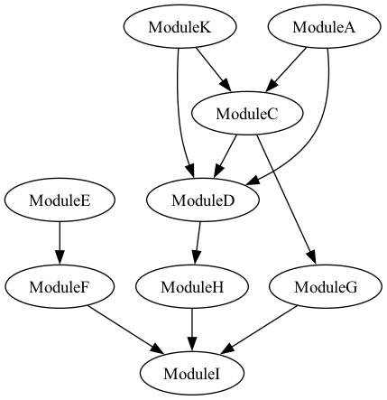

# dag 

#### 简介
一个轻量的dag调度框架

1. 安装依赖
    ```
    # 安装bazel
    brew install bazelisk
    echo "5.1.0" > .bazelversion

    # 安装graphviz 
    brew install graphviz 
    ```

2. 编译
    ```
    # macos编译debug
    bazel build //test:dag_test_debug --strip=never --define platform=macos

    # linux编译debug
    bazel build //test:dag_test_debug --strip=never --define platform=linux

    # release版本
    bazel build //test:dag_test_release --define platform=linux

    # asan版本
    bazel build //test:dag_test_asan --strip=never --define platform=linux
    ```

3. 基本特性
    - 基本的dag调度
        * 并行执行
        * 超时控制
        * dag环检测
        * 业务module插件化
        * workflow支持reset
        * dag图可视化
    - 表达式动态创建dag
        * 通过json表达式 动态创建dag
        * bison/flex解析支持【todo】
    - 动态库加载/无依赖库
        * 尽量不依赖第三方库，可以开箱即用
        * glog，gtest等基础组件 在项目中做了对应接口的实现，可以直接嵌入到其他项目中

------

#### 使用方式
1. 指定一个dag图 json配置
    ```
    std::string workflow_expression = R"({
        "workflow": "graph_name",
        "dependencies": [
            {
                "target": "ModuleB",
                "dependencies": ["ModuleA", "ModuleD"]
            },
            {
                "target": "ModuleC",
                "dependencies": ["ModuleB"]
            }
        ]
    })";
    ```

2. 编写对应的module的业务代码实现：
    
    需要继承基类，并且使用REGISTER_MODULE注册module
    ```
    // 自定义业务module
    class ModuleC: public Node {
    public:
        ModuleC() = default;
        ModuleC(const std::string& name) : Node(name) {}

        int init() override {
            return ErrorCode::SUCCESS;
        }
        int run(void *args = nullptr) override {
            LOG(INFO) << "ModuleC is running.";
            return ErrorCode::SUCCESS;
        }
    };

    // 注册module
    REGISTER_MODULE(ModuleC);
    ```

3. 触发dag执行
    ```
    // 1. 通过json表达式创建graph
    std::shared_ptr<Graph> graph = std::make_shared<Graph>();
    auto ret = JsonParser::parser_from_json(workflow_expression, graph);
    if (ret != 0) {
        LOG(ERROR) << "parser_from_json failed, ret : " << ret;
        return ret;
    }

    // 2. 创建topology
    Topology topology;
    topology.set_timeout_ms(80);
    topology.create(graph);

    // 3. 执行dag
    UserContext context;
    Workflow workflow(&topology);
    workflow.schedule(&context);
    ```

4. 可视化图
    ```
    // 可视化graph
    ImageHelper::generate_image(graph->nodes(), graph->name());
    ```
    
    


### 其他

#### 内存越界/泄漏问题测试
1. 编译asan版本
    ```
    bazel build //test:dag_test_asan --strip=never --define platform=linux
    ```

2. 如果有内存相关的问题会如下提示：
    ```
    [2025-01-09 15:12:08] [INFO] [test/test_main.cpp:501] hello dag 
    =================================================================
    ==26347==ERROR: AddressSanitizer: heap-use-after-free on address 0x621000000100 at pc 0x00000041667c bp 0x7ffca33f6910 sp 0x7ffca33f6908
    WRITE of size 4 at 0x621000000100 thread T0
        #0 0x41667b in test_asan() test/test_main.cpp:494
        #1 0x416829 in main test/test_main.cpp:502
        #2 0x7f82110ca504 in __libc_start_main (/usr/lib64/libc.so.6+0x22504)
        #3 0x404f18  (/dag_test_asan_linux+0x404f18)

    0x621000000100 is located 0 bytes inside of 4096-byte region [0x621000000100,0x621000001100)
    freed by thread T0 here:
        #0 0x7f821201a080 in operator delete[](void*) ../../.././libsanitizer/asan/asan_new_delete.cc:139
        #1 0x416617 in test_asan() test/test_main.cpp:492
        #2 0x416829 in main test/test_main.cpp:502
        #3 0x7f82110ca504 in __libc_start_main (/usr/lib64/libc.so.6+0x22504)

    previously allocated by thread T0 here:
        #0 0x7f8212019330 in operator new[](unsigned long) ../../.././libsanitizer/asan/asan_new_delete.cc:93
        #1 0x416599 in test_asan() test/test_main.cpp:488
        #2 0x416829 in main test/test_main.cpp:502
        #3 0x7f82110ca504 in __libc_start_main (/usr/lib64/libc.so.6+0x22504)
    ```

3. 或使用valgrind
    ```
    valgrind --leak-check=full ./bazel-bin/test/dag_test_debug 
    ```

#### 代码静态检查
    ```
    sh cpplint_check.sh
    ```